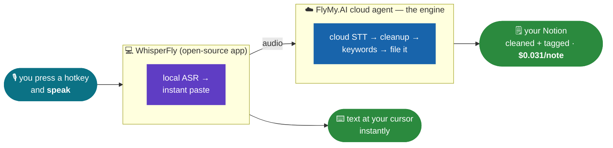

# WhisperFly 🎙️

**We killed Wispr Flow.** Built this app from **one prompt** - Claude as the builder, **FlyMy.AI cloud** as the backend.

- **Safe**: no telemetry, no third-party APIs in the app - it talks ONLY to your FlyMy.AI account; the agent holds the Notion credentials server-side. Optional fully-local offline mode (pick a model in advanced settings).
- **Cheap**: no subscription. **$0.031 per note** on our real bill (transcription + cleanup + tags + Notion filing included) - a heavy month is ~$3-6 vs their $144-180/yr, and nothing to install-time-download.

## How we did it



Open-source app shell (fork of [Handy](https://github.com/cjpais/Handy), MIT) + one FlyMy.AI agent, frozen into a fixed pipeline. The agent IS the engine - the app just records and pastes.

## Build it yourself

1. **Connect FlyMy.AI to your coding agent** - one line:
   ```bash
   claude mcp add --transport http flymyai https://mcp-agents.flymy.ai/mcp
   ```
   (claude.ai / Codex / Antigravity: add the same URL as an MCP connector, sign in with [flymy.ai](https://app.flymy.ai).)
2. **Paste one prompt** from [BUILD_PROMPT.md](BUILD_PROMPT.md) - it clones this repo, creates YOUR agent + Notion base, builds the app, and shows you the real bill.
3. **Speak.** Done.

## Use the app directly

Download `WhisperFly.dmg` from Releases, right-click -> Open (demo build is ad-hoc signed), pick a local model, grant mic + accessibility. Dictation works immediately, offline. For the Notion inbox: open **FlyMy.AI Cloud** in settings, paste your [flymy.ai](https://app.flymy.ai) API key, then **clone the [public WhisperFly agent](https://app.flymy.ai/agents/chat/kff-gefa-yjr) to your account** (agents run on YOUR account) and paste your copy's ID. Or create your own from [agent/prompt.md](agent/prompt.md).

## Share it with a friend

Send them the dmg. First launch walks them through everything: grant permissions -> paste THEIR free [flymy.ai](https://app.flymy.ai) API key -> clone the [public WhisperFly agent](https://app.flymy.ai/agents/chat/kff-gefa-yjr) to THEIR account (one Copy click; the app accepts the id straight from the URL of their copy) -> speak. Their notes go to their Notion, billed to their account at ~$0.03/note. The app ships with zero baked-in credentials.

## Numbers, receipts, dead ends

| | Wispr Flow Pro | WhisperFly |
|---|---|---|
| Price | $12-15/mo forever | **$0.031/note, pay-per-use** (or $0 in local offline mode) |
| Note -> cleaned + tagged -> Notion | not a feature | **included in the same run** |
| Offline mode | no | yes (advanced: pick a local model) |
| Idle footprint | ~800 MB RAM (Electron, user-measured) | tens of MB (native Tauri/Rust) |

Quality, honestly: top STT engines sit within 1-2 points of each other - we don't claim "more accurate". We claim a **custom dictionary** for your jargon (their #1 complaint), an editable cleanup prompt, and routing rules you own.

Everything else - full timestamped build history, real billed prices, every bug and naming detour - is in [BUILD_LOG.md](BUILD_LOG.md). Adapting via Claude? Read [CLAUDE.md](CLAUDE.md).

## License

MIT. `app/` is a fork of [Handy](https://github.com/cjpais/Handy) by CJ Pais (MIT) - thank you for the excellent base. ❤️
